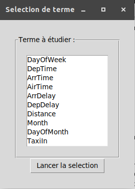
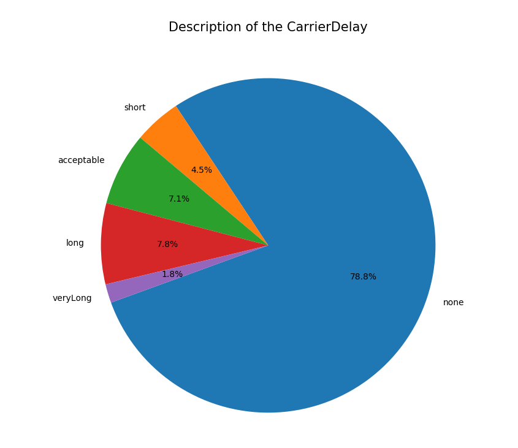
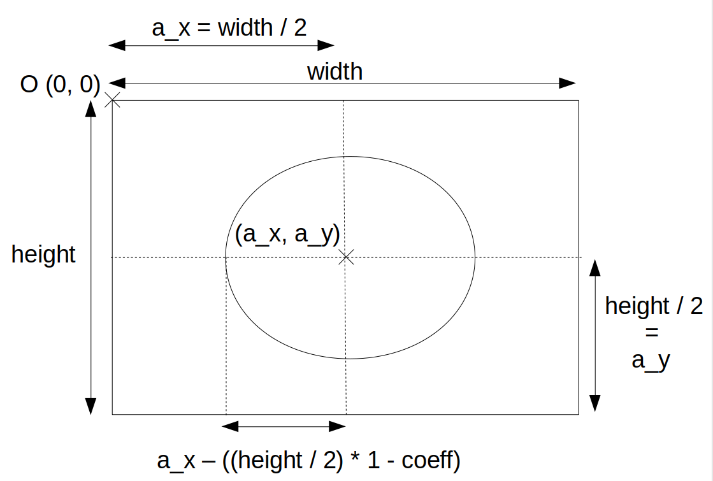
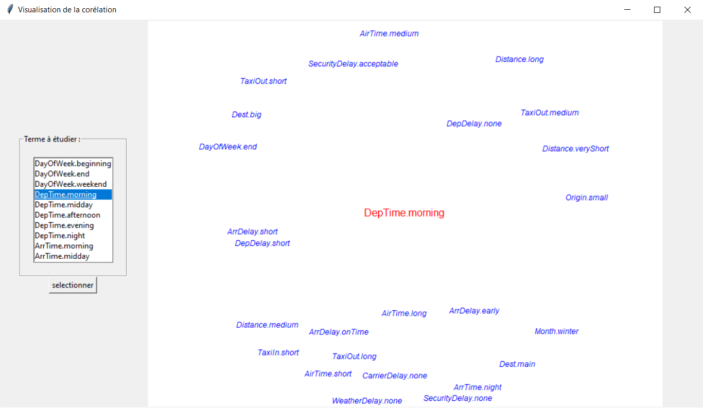
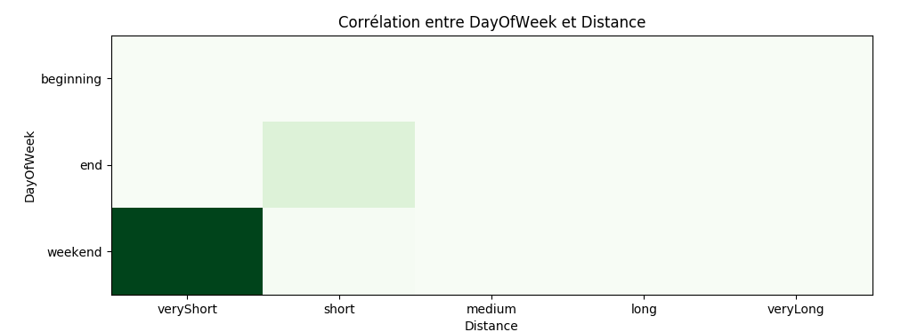
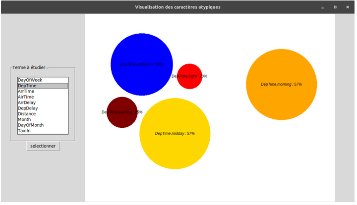

# ProjetBDDA

/!\ Il faut placer les données dans un fichier "Data" à la racine !

Pour lancer l'interface, lancez la commande à la racine du projet :

```Bash
python3 ./interface/main_menu.py
```

## Introduction :
Pour commencer notre projet, nous disposions d’une base de données des aéroports des États-Unis en 2008. Ainsi qu’un code Python et Java permettant  de lire les données et les transformer en termes flous. Nous avons décidé d’utiliser le code Python car nous sommes plus à l’aise avec Python pour faire de la visualisation.

L’objectif de ce projet est de proposer une solution pour explorer nos données. Pour cela, nous allons nous appuyer sur la logique floue pour réussir à faire “parler” les données. En effet, à l’aide des fonctions d’appartenance données par notre enseignant, nous pouvons transformer nos données en terme du langage naturel. Cela nous amène à adopter le vocabulaire de la logique floue. Ainsi, nous définissons une partition comme des paramètres, par exemple l’heure d’arrivé des avions. Notre partition est découpée en modalités, par exemple les avions qui arrivent le matin. Cela nous permettra de renvoyer une visualisation bien plus facile à comprendre pour un utilisateur lambda.

Pour réaliser notre projet, nous devons définir 3 opérations, la sélection selon la modalité d’une partition, la corrélation entre deux modalités et l’atypicité d’une modalité par rapport à sa partition.

## Visualisation du détail d'une partition :

Pour commencer, nous avons trouvé intéressant de visualiser la répartition des modalités dans une partition. Pour ce faire, nous avons utilisé le vecteur de réécriture calculé sur l’ensemble des données. On peut ainsi aisément observer les proportions des modalités dans chaque partition. Pour visualiser des proportions, nous avons immédiatement pensé à utiliser un diagramme circulaire. 

Nous avons pensé à améliorer cette représentation en utilisant un diagramme en rayon de soleil, où l’on pourrait par exemple voir la proportions des vols étant partis à un mois précis et pour chaque mois voir la proportions des vols partis en retard et ainsi de suite. Cependant, nous n’avons pas trouvé de moyen de laisser l’utilisateur choisir ce qui l'intéressait sans rendre l’interface trop compliquée. Cela nous a poussé à revenir sur notre idée de base qui est selon nous plus lisible et plus facile à utiliser pour un utilisateur lambda. Nous avons créé une interface permettant de sélectionner la partition : 



Une fois la partition choisie, l’utilisateur appuie sur ‘Lancer la sélection’, et il obtient alors un diagramme similaire à celui-là :



(Exemple d’un diagramme circulaire représentant la partition ‘CarrierDelay')

## Visualisation de la corrélation :

L’étude de la corrélation s’effectue entre deux modalités de partition qui peuvent être différentes. Par exemple on peut chercher la corrélation entre les avions en retard et les avions qui partent en début de semaine. Nous avons pensé que la représentation de la corrélation entre uniquement deux modalités n’est optimale que lorsqu’on donne un pourcentage de corrélation. Il est difficile de faire un travail de visualisation intéressant avec uniquement un chiffre. C’est pour cela que nous avons voulu plutôt travailler sur une autre problématique. Nous avons décidé de faire deux implémentations pour la visualisation de la corrélation. Dans un premier temps nous avons décidé de représenter la corrélation entre une modalités et les autres à l’aide d’un nuage de mots, où notre mot serait au centre de la figure et les termes corrélés se trouveraient en périphérie et la distance correspondrait au taux de corrélation.  
Pour ce faire, nous avons décidé de coder nous même notre solution. Nous avons utilisé les canvas de Tkinter. Nous avons positionné notre modalité au centre du canvas et nous avons calculé la corrélation avec toutes les autres modalités. Cette opération prend du temps, ainsi même sur la base de données short nous sommes obligé d’attendre 2-3 minutes. Une fois que nous avons récupéré les coefficients de corrélation, nous éliminons tous les termes non corrélés. Puis nous plaçons les modalités de manière aléatoire sur des cercles de rayon = ax -((height/2) . (1- coeff)). Comme représenté sur la figure ci-dessous.



Ainsi en fixant un x aléatoire sur notre cercle, on obtient un y à l’aide de la formule suivante : y = sqrt(rayon² - (x - ax)² + ay). Une fois cela fait, nous ajoutons les coordonnées de la modalité dans un tableau qui nous permet de vérifier que les mots ne se chevauchent pas. Cela nous donne la visualisation suivante :


(Nuage des modalités corrélées à “DepTime.morning”)

Nous avons aussi voulu proposer une visualisation de la corrélation entre deux partitions. Pour cela, nous avons choisi d’utiliser une heatmap, où plus la couleur est sombre plus les modalités sont corrélées.


(Corrélation entre les modalités de la partition ‘DayOfWeek’ et ‘Distance’)

## Visualisation de l'atypicité :

L’atypicité d’un terme est représentatif d’à quel point sa valeur est surprenante, c’est à dire s’il existe une minorité d’éléments couverts par ce terme et que ce terme est distant des valeurs plus fréquentes. La formule de l’atypicité est la suivante:

 D(v',R) = maxvR min(d(v,v'),cover(v,R),1-cover(v',R))


Où d(v,v') représente la distance entre v et v'.

On a représenté les caractères atypiques au sein d’une partition à l’aide d’un diagramme en bulles, où les les termes sont placés aléatoirement et possèdent une taille proportionnelle à leur atypicité. On vérifie bien que les bulles ne s'enchevêtrent pas en comparant la taille de chaque cercle deux à deux par rapport à la distance séparant leur centre. Pour deux cercle de centre respectif (x,y) et (x',y'), et de rayon r*R et r'*R, on teste si la formule suivante est bien vérifiée:
R*(r+r') <= sqrt((x-x')² + (y-y')²)

Où R = 100 est le rayon maximal d’une bulle, et ret r' sont les coefficients d’atypicité.

La visualisation à l’aide d’un diagramme en bulles permet de bien mettre en valeur les termes les plus atypiques, qui occupent plus de place que les termes peu atypiques. La couleur est choisie aléatoirement, permettant de différencier deux termes.


(Visualisation des éléments atypiques de la partition ‘DepTime’)

## Conclusion :

Nous avons établi une visualisation des données de l’aéroport dans le but de pouvoir déduire des liens entre les différents termes. Nous avons pu voir l’utilité de passer par des ensembles flous afin de rendre notre interface plus lisible pour un utilisateur. Le découpage des partitions en modalités permet entre autres de faire les calculs de corrélations et d’atypicité, qui donnent des informations facilement exploitables, même pour une personne qui ne connaîtrait pas du tout les données. Cela nous a permis de voir les vertues que possède l’application de la logique floues dans le cadre des bases de données.

## Dépendances:
- Tkinter
- Numpy
- Matplotlib
